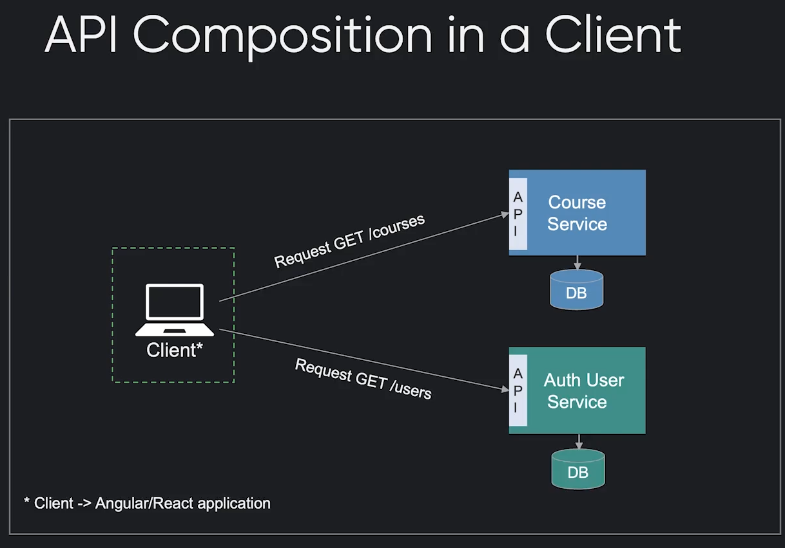
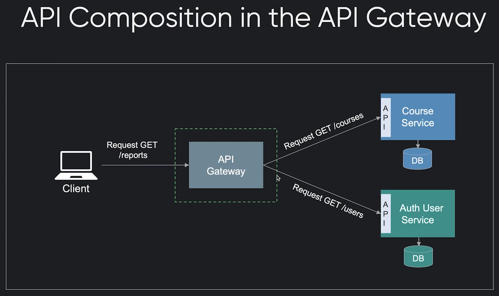
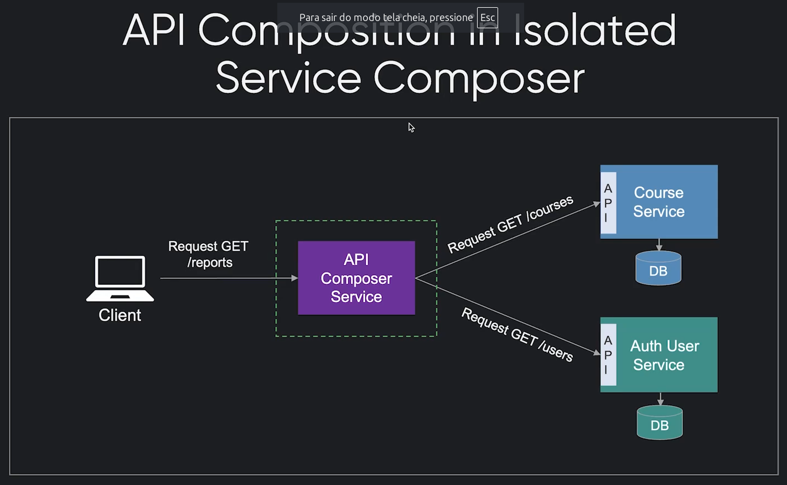
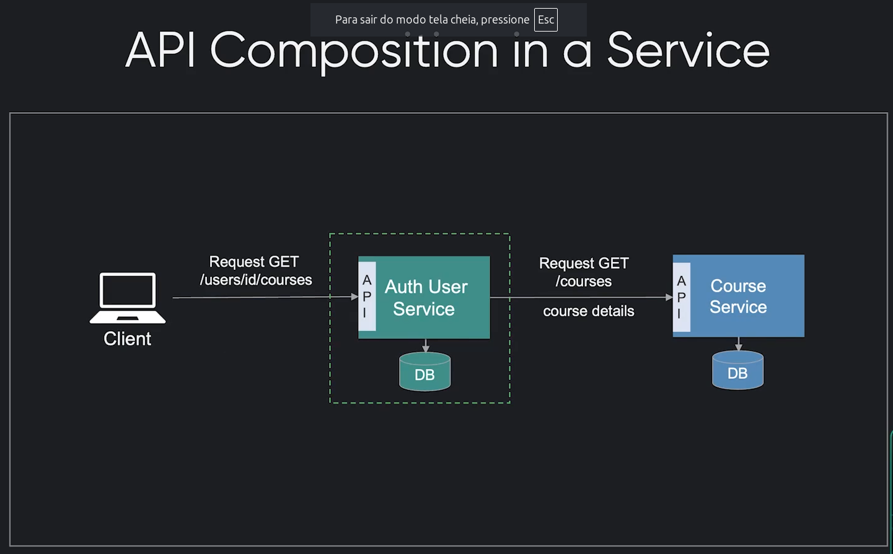
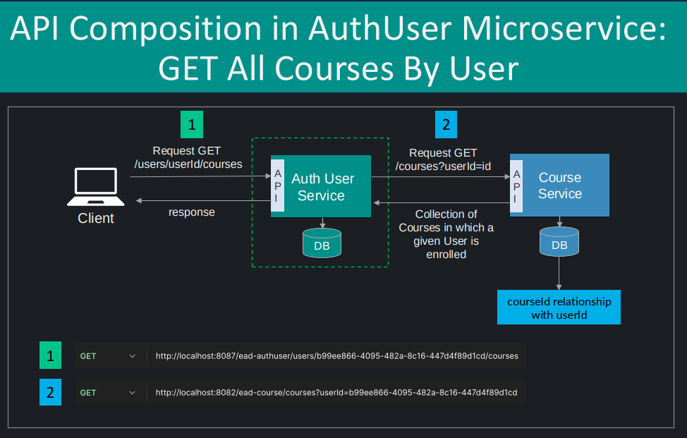
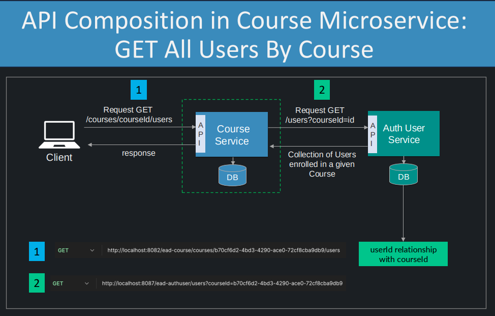

# SEMANA 2 - Spring Data JPA para Microservices: Do Básico ao Avançado

## Mapeamentos JPA, Repositories e Services para Multiplas Entidades
- Mostra o diagrama classe/Entidade Relação (BD) (BD) inicial das entidades

## Implementação Relacionamentos JPA OnetoMany e ManyToOne
- Mostra o diagrama de classe/Entidade Relação (BD) inicial das entidades com relacionamentos OnetoMany e ManyToOne entre as entidades

## FetchType Eager/Lazy, @EntityGraph, FetchMode SELECT/SUBSELECT/JOIN, @Query e @Modifying

  - **FetchType Eager/Lazy****:
    - EAGER: Carrega imediatamente os relacionamentos ao buscar a entidade principal
    - LAZY: Carrega os relacionamentos apenas quando forem explicitamente acessados (sob demanda)
    - Uso no módulo Course
  
  
  - **@EntityGraph**:
    - Permite definir quais relacionamentos devem ser carregados em uma consulta específica.
    - Útil para otimizar o carregamento evitando o problema N+1.
    - Pode ser definido na entidade ou no método de repositório.
  
  
  - **FetchMode**:
    - Controla como o JPA faz o carregamento dos relacionamentos:
      - SELECT: Faz uma consulta separada para cada relacionamento (padrão)
      - SUBSELECT: Faz uma subconsulta para carregar todos os relacionamentos de uma vez
      - JOIN: Usa JOIN para carregar a entidade e seus relacionamentos em uma única consulta
  
  
  - **@Query**:
    - Permite definir consultas personalizadas usando JPQL ou SQL nativo
    - Oferece mais controle sobre a consulta do que os métodos gerados automaticamente
    - Pode ter parâmetros nomeados ou posicionais
    
  
  - **@Modifying**:
    - Usado em conjunto com @Query para operações de atualização ou deleção
    - Permite executar DML (INSERT, UPDATE, DELETE) personalizado
    - Necessário quando a consulta modifica dados ao invés de apenas recuperá-los

## Deleção de Relacionamento Cascade.ALL e Método de Deleção Customizado

  - **CascadeType.ALL**
    - O cascade propaga todas as operações de uma entidade para as demais entidades associadas a esta entidade automaticamente.
    - Efeitos:
      - **PERSIST**: Salva as lições(lessons) junto com um módulo(module)
      - **MERGE**: Atualiza as lições(lessons) ao atualizar módulo(module)
      - **REMOVE**: Deleta as lições(lessons) ao deletar o módulo(module)
      - **REFRESH**: Recarrega as lições(lessons) ao recarregar o módulo(module)
      - **DETACH**: Desanexa as lições(lessons) ao desanexar o módulo(module)
      
    - **Cuidados:**
      - Pode causar deleções não intencionais
      - Evitar em relacionamentos bidirecionais
      - Considerar usar cascades específicos (ex: PERSIST, MERGE) ao invés de ALL
      - Avaliar impacto em relacionamentos complexos ou circulares

## API RESTfull para Course com Validação Spring Validation - Método POST
- ## O que foi feito?
  - ### REGRA DE NEGÓCIO: Salvar dados de um curso
  - Foi criado o método para **salvar dados de um curso** na interface CourseService e em sua implementação
  - Salvar os dados, deve **retornar status 201 Created com os dados do curso salvo** no banco de dados.
  - End point para salvar dados de um curso
    - **POST -> ead-course/courses**. Exemplo de body:
        ``` json
        {
          "name": "Curso Spring Security",
          "description": "Crie Autenticação com Spring Security em Microservices",
          "userInstructor": "ed235441-89e3-4de5-87af-0cfb2ac8a9d8",
          "courseStatus": "CONCLUDED",
          "courseLevel": "BEGINNER"
        }
        ``` 
  - ### REGRA DE NEGÓCIO: Antes de salvar, verificar se há um curso existe com o mesmo nome informado no corpo da requisição
    - deve retornar 409
    - Foir criado um método para **verificar se já existe um curso com base no nome** dentro de CourseRepository


## API RESTful para Course - Métodos GET, DELETE e PUT

  - O que foi feito?
    - ### REGRA DE NEGÓCIO: retornar todos os cursos 
    - Foi criado o método para **listas todos os cursos** na interface CourseService e em sua implementação
    - End point para listar todos os cursos salvos
    - deve retornar 200
      - **GET -> ead-course/courses**. Exemplo de body:
      
  - ### REGRA DE NEGÓCIO: retornar dados de um curso
    - Foi criado o método para **retornar dados de um curso** na interface CourseService e em sua implementação
    - End point para retornar dados de um curso
    - deve retornar 200
      - **GET -> ead-course/courses/courseId**. O id do curso a ser buscado é informado no lugar de **courseId**
      
    - ### REGRA DE NEGÓCIO: apagar um curso
      - Foi criado o método para **atulizar dados de um curso** na interface CourseService e em sua implementação
      - deve retornar 200
      - **DELETE -> ead-course/courseId**. O id do curso a ser apagado é informado no lugar de **courseId**

    - ### REGRA DE NEGÓCIO: atulizar um curso
      - Foi criado o método para **atulizar dados de um curso** na interface CourseService e em sua implementação 
      - deve retornar 200
      - **PUT -> ead-course/courseId**. O id do curso a ser atulizado é informado no lugar de **courseId**. Exemplo de body:
        ``` json
        {
          "name": "Curso Spring Security",
          "description": "Crie Autenticação com Spring Security em Microservices",
          "userInstructor": "ed235441-89e3-4de5-87af-0cfb2ac8a9d8",
          "courseStatus": "CONCLUDED",
          "courseLevel": "BEGINNER"
        }
        ``` 
        
## API RESTful para Module com Validações - Método POST
- O que foi feito?
  - ### REGRA DE NEGÓCIO: Salvar dados de um módulo
      - Foi criado o método para **salvar dados de um módulo** na interface ModuleService e em sua implementação
      - Salvar os dados, deve **retornar status 201 Created com os dados do módulo salvo** no banco de dados.
      - End point para salvar dados de um módulo
          - **POST -> ead-course/courses**. Exemplo de body:
              ``` json
              {
                "name": "Curso Spring Security",
                "description": "Crie Autenticação com Spring Security em Microservices",
                "userInstructor": "ed235441-89e3-4de5-87af-0cfb2ac8a9d8",
                "courseStatus": "CONCLUDED",
                "courseLevel": "BEGINNER"
              }
              ``` 
  - ### REGRA DE NEGÓCIO: Salvar dados de um módulo com um curso associado

## API RESTful para Module - Métodos GET, DELETE e PUT
  - O que foi feito?
    - ### REGRA DE NEGÓCIO: Listar todos os cursos de um módulo
      - GET ---->  **"/courses/{courseId}/modules"**
    - ### REGRA DE NEGÓCIO: Mostrar dados de um curso dentro de um módulo
      - GET ---->  **"/courses/{courseId}/modules/{moduleId}"**
    - ### REGRA DE NEGÓCIO: Deletar um curso dentro de um módulo
      - DELETE ---->  **"/courses/{courseId}/modules/{moduleId}"**
    - ### REGRA DE NEGÓCIO: Atualizar um curso dentro de um módulo
      - PUT ---->  **"/courses/{courseId}/modules/{moduleId}"**

## API RESTful para Lesson com Validações - Método POST
  - O que foi feito?
    - ### REGRA DE NEGÓCIO: Salvar dados de um lição em um módulo
        - POST ---->  **"/modules/{moduleId}/lessons"**

## RESTful para Lesson - Métodos GET, DELETE e PUT

## Tratamento de Exceptions Globais Avançado via ControllerAdvice

## Avançados em APIs com Specification e Paginação

## Filtros Avançados em APIs com Specification Avançado para Relacionamentos e Paginação

## Boas Práticas de Datas em APIs utilizando o Padrão ISO 8601 UTC e Configuração Global

## Serialização de paginação do Spring Data na Configuração Global

## Principais Bibliotecas de Logging, Log Levels e Logging no Spring com Logback

- **COMANDO: mvn spring-boot:run -Dspring-boot.run.arguments=--logging.level.com.ead=TRACE**
    - Este é um comando Maven para executar uma aplicação Spring Boot com configurações específicas de logging. Vou detalhar cada parte:

        - **mvn spring-boot:run** - Comando básico para executar uma aplicação Spring Boot usando Maven
        - **-Dspring-boot.run.arguments** - Flag para passar argumentos para a aplicação Spring Boot
        - **--logging.level.com.ead=TRACE** - Configura o nível de log para o pacote com.ead como TRACE

    - O nível TRACE é o mais detalhado dos níveis de log, seguindo esta hierarquia (do menos para o mais detalhado):
        - ERROR
        - WARN
        - INFO
        - DEBUG
        - TRACE

        - Ao definir como TRACE, você verá todos os logs possíveis para o pacote com.ead, o que é muito útil para debug profundo e entender exatamente o que está acontecendo na aplicação.

- ## Definindo configuração logs no application.yml
  ```yaml
        output:
            ansi:
                enabled: Always # Habilita cores ANSI no console sempre
    
    logging:
        level:
            com.ead: TRACE # Logs mais detalhados para seu pacote específico
            root:  # Nível padrão para todos os logs não especificados
            org.springframework.web: DEBUG # Logs detalhados das requisições web
            org.hibernate: INFO  # Logs padrão do Hibernate
  ```

  - Esta configuração permite:
      - Saída colorida no console (mais fácil de ler diferentes níveis de log)
      - Logs muito detalhados (TRACE) para seu código em com.ead
      - Logs de nível DEBUG para o Spring Web (útil para debugar requisições/respostas)
      - Logs de nível INFO para Hibernate e demais componentes

  - É uma configuração boa para desenvolvimento, pois:
      - Você vê todos os detalhes do seu código (com.ead)
      - Vê informações úteis sobre requisições web
      - Mantém os logs de framework em um nível razoável para não sobrecarregar o console
      - Para produção, você provavelmente quereria aumentar os níveis (usar mais INFO/WARN e menos DEBUG/TRACE).

- ## Implementação e Boas Práticas de Logging nos Microservices com Log4J2

## SEMANA 3 Conceitos de API Composition Pattern
 - O API Composition Pattern é um padrão de design arquitetural usado em microsserviços para combinar dados de múltiplos serviços em uma única resposta, evitando que o cliente precise fazer várias chamadas independentes.
 - Os principais benefícios deste padrão são:
   - Redução de latência - Em vez de múltiplas chamadas HTTP, o cliente faz apenas uma requisição
   - Melhor experiência do cliente - A complexidade de agregar dados é movida para o servidor
   - Menor acoplamento - Os clientes não precisam conhecer a estrutura interna dos microsserviços
   - Menor tráfego de rede - Reduz o número total de requisições HTTP
 
 - É importante notar que este padrão também traz alguns desafios:
   - Possível ponto único de falha se o compositor de API falhar
   - Maior complexidade no servidor para gerenciar múltiplas chamadas
   - Necessidade de lidar com falhas parciais quando algum serviço não responde
 
 - O padrão é especialmente útil quando você tem dados relacionados distribuídos em diferentes microsserviços que frequentemente precisam ser apresentados juntos na interface do usuário.

 - Formas de implementações do API Composition Pattern
   - API Composition Pattern in a Client
     - 
   - API Composition Pattern in the API Gateway 
     - 
   - API Composition Pattern in Isolated Service Composer
     - 
   - ## **API Composition Pattern in a Service (Implementação que será usada no curso)**
     - 
     
     - ### REGRA DE NEGÓCIO: Buscar todos os cursos que um usuário está escrito
     - 
       - (1) A requisição irá partir do cliente da api(postman) para o módulo AuthUser.
       - (1) A requisição irá conter o id do usuário.
       - **(2) Internamente será implementada uma consuta ao módulo Courte para buscar dados de Módulos que o usuário está inscrito.**
       
     - ### REGRA DE NEGÓCIO: Buscar todos os usuários inscritos em um curso
       - 
       - (1) A requisição irá partir do cliente da api(postman) para o módulo Course.
       - (1) A requisição irá conter o id do curso.
       - **(2) Internamente será implementada uma consuta ao módulo AuthUser para buscar dados de Usuários inscritos no módulo(Coruse).**
       
     - ### Base de dados de Course e AuthUser 
       - Novas tabelas: em ambos os serviços será preciso uma tabela auxiliar
       - **Módulo Course**:A tabela auxiliar será usada para guardas os ids de usuários em Course para que ó modulo consiga **encontrar os Cursos** que um **usuário** está inscrito.
       - **Módulo AuthUser**: A tabela auxiliar será usada para guardas os ids de cursos em Auth para que ó modulo consiga **encontrar os Usuários** inscritos em um **módulo**.


 - ## Mapeamento de Relacionamentos para Comunicação entre Microservices

 - ## API Composition Pattern - Preparar Métodos GetAll Courses by User

 - ## API Composition Pattern em Course Microservice


## Off topics do curso:
 - Spring AOP aplicado no curso: [material de referência teórica](https://medium.com/@devgabs/spring-aop-com-anota%C3%A7%C3%B5es-a14d928b845e)
   - Implementação de Spring AOP no projeto está classe: PerformanceMethodAspect e anotação @Monitored.
   - @Monitored foi aplicada em cada método de controller/serviceImpl para fins de aprendizado

